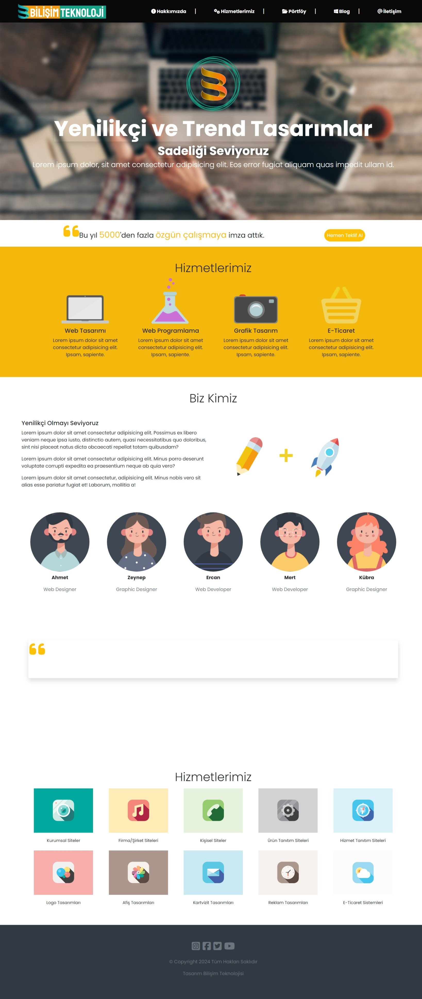
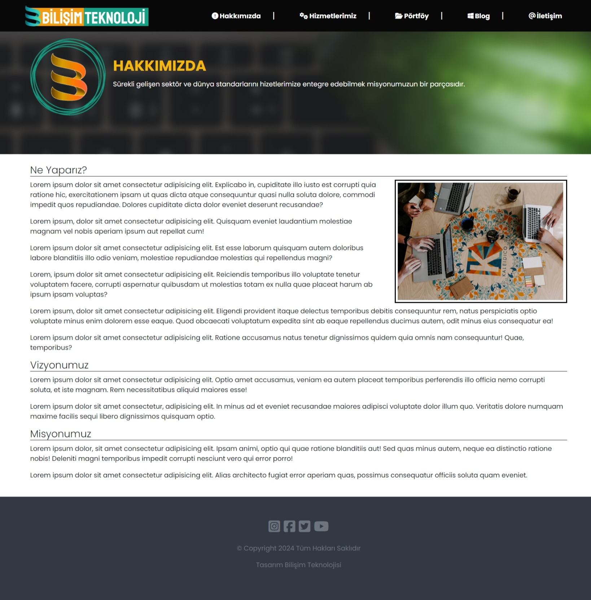
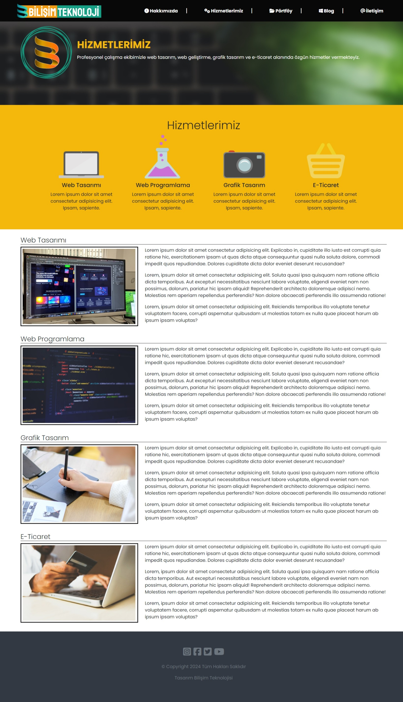

# bootstrap-website-project

Bu proje, HTML, Bootstrap, CSS,  ve JavaScript kullanılarak hazırlanmıştır, Web sitesi tasarımı ve geliştirmesi yapan örnek bir şirket web sitesi arayüz porjesidir. Projenin amacı, kullanıcıların şirketleri ve/veya kendileri için bir web sitesi hazırlatmak için bilgi ve yardım alabilecekleri bir platform sunmaktır.

## Özellikler

- **Responsive Tasarım**: Farklı cihaz boyutlarında sorunsuz çalışır.
- **Çok sayfalı tasarım**: Her bölüm için ayrı tasarlanmış sayfalar.

## Kullanılan Teknolojiler

- HTML5
- Bootstrap
- CSS3
- JavaScript

## Kurulum

Projenin yerel ortamınızda çalıştırılması için aşağıdaki adımları takip edebilirsiniz:

1. **Depoyu klonlayın:**

   ```bash
   git clone https://github.com/cengo14/bootstrap-website-project
   ```

2. **Proje dizinine gidin:**

   ```bash
   cd bootstrap-website-project
   ```

3. **index.html** dosyasını tarayıcınızda açın.

## Kullanım

1. **Aktif navbar linkleri**: Header bölümündeki nav linklerini kullanarak ilgili sayfaya ulaşabilirsiniz.
2. **Responsive**: Her çözünürlükteki ekran boyutlarına uyumlu web tasarımı

## Katkıda Bulunma

Projeye katkıda bulunmak isterseniz, lütfen önce bir issue açarak neyi geliştirmek istediğinizi belirtin. Pull request'ler memnuniyetle kabul edilir.

1. Bu projeyi forklayın.
2. Yeni bir dal (branch) oluşturun: `git checkout -b ozellik/istediğiniz-isim`
3. Yaptığınız değişiklikleri işleyin: `git commit -m 'Özellik ekle: istediğiniz-özellik'`
4. Dalınızı push edin: `git push origin ozellik/istediğiniz-isim`
5. Bir pull request açın.


## İletişim

Proje ile ilgili herhangi bir sorunuz veya geri bildiriminiz varsa, lütfen [cengoaydemir14@gmail.com](cengoaydemir14@gmail.com) adresinden bana ulaşın.

---
## Ekran Görüntüleri
  
